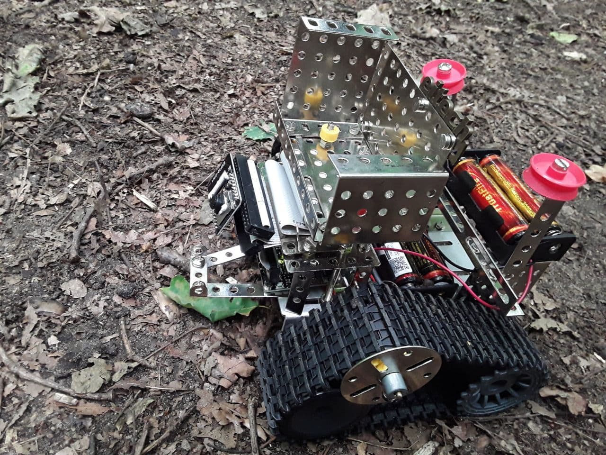
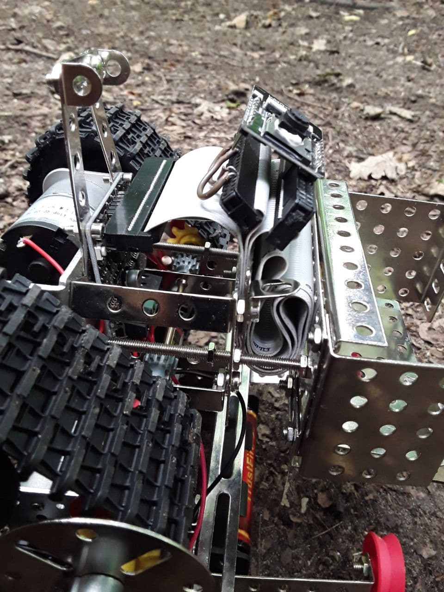
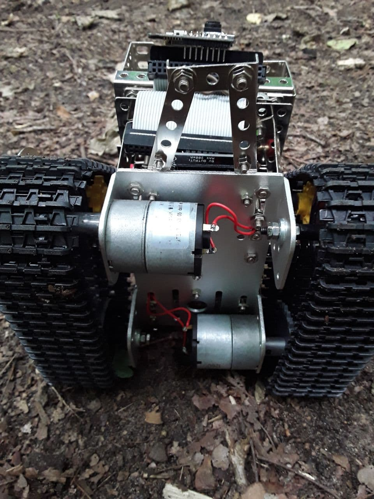
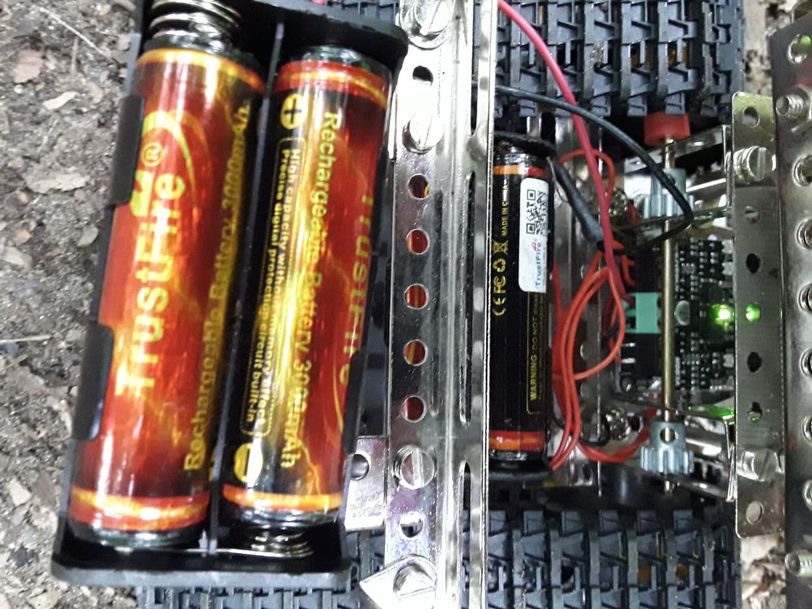
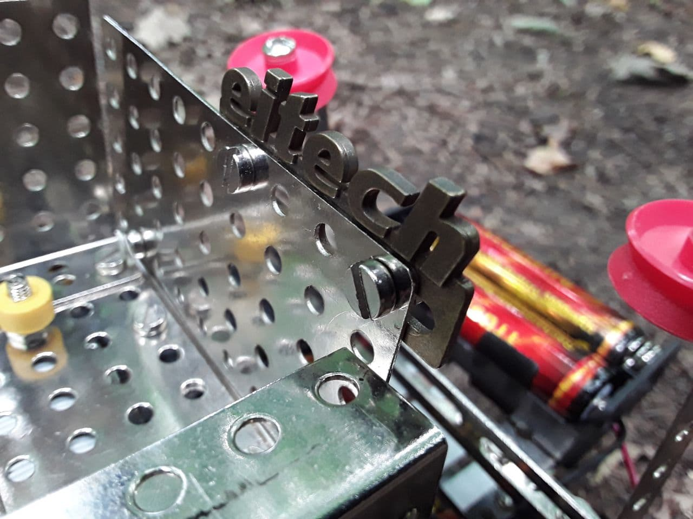

# RC Snowmobile

TL;DR

I build a low-cost tracked vehicle with a ESP32-CAM module, which
can be controlled via WIFI with an <a href="https://github.com/rnauber/ESPHomeRC">Open Source Android app ESPHomeRC</a>.


[<br> click for higher quality video](media/snowmobile.mp4)


## The Hardware
### Bill of Materials
You need:

* an ESP32-CAM module like [this](https://www.amazon.de/gp/product/B08BL6VG76/ref=ppx_yo_dt_b_asin_title_o01_s01?ie=UTF8&psc=1)

* a platform with tracks and motors [like this](https://www.aliexpress.com/item/32858056642.html)

* an H-bridge module like the [MDD3A](https://www.cytron.io/p-3amp-4v-16v-dc-motor-driver-2-channels)
* 2-4 Li-Ion 18650 batteries like [these](https://www.amazon.de/kraftmax-Pack-18650er-Akku-Schutzschaltung/dp/B08PL1HRBQ/ref=sr_1_3?__mk_de_DE=%C3%85M%C3%85%C5%BD%C3%95%C3%91) and a holder

### The Assembly
Connect the H bridge to the ESP32 like this:

|ESP Pin |   H Bridge           | 
|--------|--------------|
|GPIO14   | M1A |
|GPIO15   | M1B |
|GPIO12   | M2A |
|GPIO13   | M2B |
|5V         | 5V |
|GND       | GND |


|   |   |   | 
|---|---|---|
|  |  |
|  |  |
|  |  |


## The Firmware
[The firmware](firmware/snowmobile.yaml) is completely open and easily hackable. 
It is based on <a href="https://esphome.io/"></a>. You just describe your setup in a yaml file and a firmware will be generated.

### Preparation
<a href="https://esphome.io/guides/getting_started_command_line.html#installation">Install  </a>

### Build  and upload

Get a *3.3V USB to serial adapter* (like [this](https://www.amazon.de/gp/product/B089YTXK8V?psc=1)) and connect it:

|ESP Pin |  ... to         | 
|--------|--------------|
|GPIO0  | GND |
|3.3V     | 3.3V |
|VCR  | RX |
|VCT   | TX  |
|GND  | GND  |


```
esphome run snowmobile.yaml 
```

## The software
Then you can control your vehicle with this <a href="https://github.com/rnauber/ESPHomeRC">Open Source Android app  ESPHomeRC</a>.

An example for the javascript controller running on your android device is given here:

```javascript
outp = {};
outp.display = "Hi from everest controller, I am running because " + 
                inp["reason"] + " at " + inp["timestamp_ms"] + " ms";
        
if (typeof i == "undefined") {
    i = 0;
}

i++;
outp.display += " i=" + i +"\n";
//outp.log="log " + i + "  " + inp.user.x + " " + inp.user.y; 

var fwd = inp.user.y * 2.0 ;
fwd = Math.max(Math.min(1.0, fwd), -1.0); //limit to +-1.0

var lr = inp.user.x;
if (Math.abs(lr) > 0.3)
  lr = lr * 1.5;
else
  lr = 0.0;
  
var left = fwd + lr;
var right = fwd - lr; 

outp.hbridge = [
               {"index":0, "strength": -left * inp.user.aux0 , "brake":false}, 
               {"index":1, "strength": -right * inp.user.aux0, "brake":false},
               {"index":2, "strength":  inp.user.aux1, "brake":false},
];

outp.user = {};
outp.user.aux_labels=["vmax", "light"]; // aux0 = vmax, aux1=light
outp.user.interval_ms = 10000 ;// regular interval to call this script, 0 means as fast as possible...

```


